# Hotel Management Toolbox Architecture

This document describes the architecture of the Hotel Management Toolbox system.

## DB Admin Architecture

```mermaid
---
title: DB Admin Architecture
config:
  layout: dagre
  flowchart:
    handDrawn: true
    curve: basis
    htmlLabels: false
---
flowchart TD
  subgraph "👥 DB Admins"
    DBA["🛡️ DB Admins"]
    U2["🎯 Cursor IDE<br/>**MCP Client**"]
    U1["🖥️ CLI & Python"]
  end
  subgraph "🚀 App Layer"
    A1["🎮 main.py<br/>**ENTRY**"]
    A2["🤖 AI Agents<br/>src/agents/"]
    A3["⚙️ Config<br/>Manager"]
    A4["🧪 Test Suite"]
  end
  subgraph "🤖 LLM Service"
    LLM["LLM<br/>(Gemini, GPT, etc.)"]
  end
  subgraph "🛠️ db_admin Toolbox Server (MCP)"
    T1["🔧 db_admin<br/>toolbox<br/>(MCP Server, Port 5051)"]
    T1Conf["📋 tools_db_admin.yaml"]
  end
  subgraph "🗄️ DB"
    DB["🐘 PostgreSQL"]
    TableHotels["🏨 hotels<br/>table"]
  end
  subgraph "🔧 Setup & Config"
    S1["📦 Setup Scripts"]
    S2["🚀 Server Mgmt"]
    S3["🔐 .env"]
    S4["📄 Templates"]
  end
  DBA -.->|"Uses"| T1
  U2 -.->|"MCP Protocol (db_admin)"| T1
  U1 -.->|"Runs agents & scripts"| A1
  U1 -.->|"Testing"| A4
  A1 -->|"Uses"| A2
  A1 -->|"Uses"| A3
  A2 -.->|"Uses SDK"| SDK
  A4 -.->|"HTTP API"| T1
  T1 -->|"Loads"| T1Conf
  T1 -.->|"Executes SQL"| DB
  DB --> TableHotels
  S1 -.->|"DB Setup"| DB
  S1 -.->|"MCP Config"| U2
  S2 -->|"Starts"| T1
  S3 -->|"Env Vars"| T1
  S3 -->|"Env Vars"| A3
  S4 -.->|"Templates"| S3
  T1 -.->|"MCP Server"| U2
  SDK -->|"MCP/HTTP"| T2
  T2 -->|"Loads"| T2Conf
  T2 -.->|"Executes SQL"| DB
  DB --> TableHotels
  A2 -.->|"Natural Language Query/Response"| LLM
  classDef userStyle fill:#e3f2fd77,stroke:#1976d2,stroke-width:3px,color:#0d47a1,font-size:15px,font-family:Courier New, font-style:italic
  classDef appStyle fill:#f8bbd033,stroke:#6a1b9a,stroke-width:3px,color:#4a148c,font-size:15px,font-family:Courier New
  classDef serverStyle fill:#c8e6c9aa,stroke:#388e3c,stroke-width:4px,color:#1b5e20,font-size:15px
  classDef dbStyle fill:#ffecb3c4,stroke:#f57c00,stroke-width:4px,color:#e65100,font-size:15px
  classDef setupStyle fill:#fce4ec,stroke:#c2185b,stroke-width:3px,color:#880e4f,font-size:14px,font-family:Courier New, font-style:italic
  class DBA,U2,U1 userStyle
  class A1,A2,A3,A4 appStyle
  class T1,T1Conf serverStyle
  class DB,TableHotels dbStyle
  class S1,S2,S3,S4 setupStyle
  style A1 stroke-width:7px,stroke-dasharray:6 3,fill:#fffde7
  style DB stroke-width:7px,fill:#e3ffe6
```



## Hotel User Architecture

```mermaid
---
title: Hotel User Architecture
config:
  layout: dagre
  flowchart:
    handDrawn: true
    curve: basis
    htmlLabels: false
---
flowchart TD
  subgraph "👥 Hotel Clerks"
    Clerk["🏨 Hotel Clerks"]
    U1["🖥️ CLI & Python"]
  end
  subgraph "🚀 App Layer"
    direction LR
    A1["🎮 main.py<br/>**ENTRY**"]
    A2["🤖 AI Agent<br/>interactive_hotel_agent"]
    A3["⚙️ Config Manager<br/>config.py<br/>"]
  end
  subgraph "🔌 ToolboxClient"
    SDK["🔌 ToolboxClient<br/>Python SDK"]
  end
  subgraph "🤖 LLM Service"
    LLM["LLM<br/>(Gemini, GPT, etc.)"]
  end
  subgraph "🛠️Toolbox Server (MCP)"
    T2["🔧 hotel_agent<br/>toolbox<br/>(MCP Server, Port 5052)"]
    T2Conf["📋 tools_hotel_agent.yaml"]
  end
  subgraph "⏰ Time Server (MCP)"
    TIME_HTTP["⏰ time_server<br/>HTTP MCP Server"]
  end
  subgraph "🗄️ DB"
    DB["🐘 PostgreSQL"]
    TableHotels["🏨 hotels<br/>table"]
  end
  Clerk -.->|"Uses"| U1
  U1 -.->|"Invokes main.py"| A1
  A1 -->|"Uses"| A2
  A1 -.->|"Loads config"| A3
  A2 -.->|"Uses SDK"| SDK
  SDK <--> |"MCP/HTTP"| T2
  SDK <--> |"MCP/HTTP"| TIME_HTTP
  A2 -.->|"Uses time_server"| TIME_HTTP
  T2 -->|"Loads"| T2Conf
  T2 -.->|"Executes SQL"| DB
  DB --> TableHotels
  A2 -.->|"Natural Language Query/Response"| LLM
  classDef userStyle fill:#e3f2fd77,stroke:#1976d2,stroke-width:3px,color:#0d47a1,font-size:15px,font-family:Courier New, font-style:italic
  classDef appStyle fill:#f8bbd033,stroke:#6a1b9a,stroke-width:3px,color:#4a148c,font-size:15px,font-family:Courier New
  classDef sdkStyle fill:#fffde7,stroke:#1976d2,stroke-width:3px,color:#0d47a1,font-size:15px
  classDef serverStyle fill:#c8e6c9aa,stroke:#388e3c,stroke-width:4px,color:#1b5e20,font-size:15px
  classDef dbStyle fill:#ffecb3c4,stroke:#f57c00,stroke-width:4px,color:#e65100,font-size:15px
  class Clerk,U1 userStyle
  class A1,A2,A3 appStyle
  class SDK sdkStyle
  class T2,T2Conf,TIME_HTTP serverStyle
  class DB,TableHotels dbStyle
  style A1 stroke-width:7px,stroke-dasharray:6 3,fill:#fffde7
  style DB stroke-width:7px,fill:#e3ffe6
```



## MCP Server Modes and Management

The Hotel Management Toolbox supports both STDIO and HTTP modes for its MCP servers, depending on the use case:

- **db_admin**
  - STDIO mode (port 5051): Managed by Cursor for IDE integration.
  - HTTP mode (port 5054): For Python agents, Swagger UI, and direct HTTP access.
- **hotel_agent**
  - STDIO mode (port 5052): Managed by Cursor for IDE integration.
  - HTTP mode (port 5053): For Python agents, Swagger UI, and direct HTTP access.
- **time_server**
  - HTTP mode only (default port, varies): Used by both Cursor and Python agents. Does not support STDIO/MCP protocol.

### MCP Server Summary Table

| Server        | Port  | Mode   | Managed By         |
|---------------|-------|--------|--------------------|
| db_admin      | 5051  | STDIO  | Cursor             |
| db_admin      | 5054  | HTTP   | User/Script        |
| hotel_agent   | 5052  | STDIO  | Cursor             |
| hotel_agent   | 5053  | HTTP   | User/Script        |
| time_server   | varies| HTTP   | User/Script/Cursor |

- **Note:** Only one mode (STDIO or HTTP) is supported per process. To support both, run two instances on different ports.
- **time_server** is HTTP-only and does not support STDIO/MCP protocol.

#### Detailed MCP Server Mode Diagram

```mermaid
---
title: MCP Server Mode
config:
  layout: dagre
  flowchart:
    handDrawn: true
    curve: basis
    htmlLabels: false
---
flowchart TD
  subgraph "👥 Users"
    DBA["🛡️ DB Admins"]
    Clerk["🏨 Hotel Clerks"]
    Cursor["💻 Cursor IDE<br/>MCP Client"]
    Py["🐍 Python/CLI"]
  end

  subgraph "🛠️ MCP Servers"
    DB_STDIO["🔧 db_admin<br/>STDIO<br/>Port 5051"]
    DB_HTTP["🔧 db_admin<br/>HTTP<br/>Port 5054"]
    HA_STDIO["🏨 hotel_agent<br/>STDIO<br/>Port 5052"]
    HA_HTTP["🏨 hotel_agent<br/>HTTP<br/>Port 5053"]
    TIME_HTTP["⏰ time_server<br/>HTTP<br/>(varies)"]
  end

  subgraph "🗄️ DB"
    DB["🐘 PostgreSQL"]
  end

  %% Connections
  DBA -.->|Uses| Cursor
  Clerk -.->|Uses| Cursor
  DBA -.->|Uses| Py
  Clerk -.->|Uses| Py

  Cursor -- "STDIO (5051)" --> DB_STDIO
  Cursor -- "STDIO (5052)" --> HA_STDIO

  Py -- "HTTP (5054)" --> DB_HTTP
  Py -- "HTTP (5053)" --> HA_HTTP

  Cursor -- "HTTP (varies)" --> TIME_HTTP
  Py -- "HTTP (varies)" --> TIME_HTTP

  DB_STDIO -.->|SQL| DB
  DB_HTTP -.->|SQL| DB
  HA_STDIO -.->|SQL| DB
  HA_HTTP -.->|SQL| DB

  %% Styles
  classDef stdio fill:#e3f2fd,stroke:#1976d2,stroke-width:2px;
  classDef http fill:#c8e6c9,stroke:#388e3c,stroke-width:2px;
  class DB_STDIO,HA_STDIO stdio
  class DB_HTTP,HA_HTTP,TIME_HTTP http
```



This diagram shows the dual-mode setup, shared source code, and all user/server connections.

### Viewing Running MCP Servers

You can use the `scripts/tools/list_mcp_servers.sh` script to view all running MCP servers, their ports, modes, and PIDs:

```bash
bash scripts/tools/list_mcp_servers.sh
```

This will print a table showing which servers are running, their connection mode, and their process IDs.

## Architecture Overview

The Hotel Management Toolbox follows a modular architecture with clear separation of concerns:

### User Interface Layer
- **CLI/Python Scripts**: Direct interaction through command-line tools and Python scripts
- **Cursor IDE**: MCP client integration for seamless development experience.
  - **Connection Mode**: Cursor manages its own `toolbox` server instances, connecting via `--stdio` to each MCP server.
  - **Configuration**: The connection is defined in `.cursor/mcp.json` and requires **absolute paths** to the `toolbox` binary and each toolset YAML file to function correctly, as the execution context's working directory is not guaranteed.
  - **Access Control**: DB Admins and Hotel Clerks connect to different MCP servers, ensuring strict separation of privileges.

### Application Layer
- **main.py**: Central entry point providing easy access to all system components
- **src/agents/**: AI-powered agents for hotel management operations
- **src/utils/config.py**: Centralized configuration management
- **examples/**: Usage demos and how-to scripts
- **tests/**: Automated, assertion-based tests

### Toolbox Server Layer
- **db_admin toolbox server**: Exposes only DBA tools (list-tables, describe-table, execute-sql)
- **hotel_agent toolbox server**: Exposes only hotel management tools (booking, hotel info, etc.)
- **Each server**: Loads its own toolset YAML config

### Database Layer
- **PostgreSQL**: Primary database for hotel and booking data
- **hotels table**: Core data structure for hotel information

### Setup & Configuration
- **scripts/setup/**: Scripts for database setup and MCP configuration (split into `cursor` and `http` directories).
- **scripts/tools/**: Server management and startup scripts (now starts both MCP servers)
- **.env**: Environment variables for configuration
- **config/templates/**: Configuration templates for easy setup

## Key Features

1. **MCP Integration**: Cursor IDE can directly access hotel management tools and DBA tools, each via their own MCP server
2. **Environment-Driven**: All configuration through environment variables
3. **Modular Design**: Clear separation between agents, tools, and data
4. **Easy Setup**: One-command setup script for complete system initialization
5. **Multiple Interfaces**: CLI, Python API, and MCP client support
6. **Access Control**: Strict separation of tool access for DBAs and hotel clerks

## LLM Usage in the Architecture

- **App Layer (AI Agent):** Uses an LLM to interpret user queries, reason, select tools, and format responses.
- **Toolbox Servers (MCP Servers):** Do NOT use an LLM. They only execute tools (SQL, API calls, etc.) and return structured data.
- **Access Control:** Each MCP server is only accessible to its intended user group, enforcing security and separation of duties.

### Summary Table

| Component                | Uses LLM? | Purpose                                      | Access Scope           |
|--------------------------|-----------|----------------------------------------------|------------------------|
| db_admin MCP Server      | No        | Executes DBA tools, runs SQL, returns data   | DB Admins only         |
| hotel_agent MCP Server   | No        | Executes hotel tools, returns data           | Hotel Clerks only      |
| App Layer/Agent          | Yes       | Interprets user queries, reasons, formats    | All (via LLM)          |
| Cursor IDE               | No*       | Sends tool requests, displays results        | All (via MCP servers)  |

*Cursor can use an LLM for chat, but not for tool execution unless you wire it up that way.

### Project Directory Structure

- **examples/**: Usage demos and "how-to" scripts. These scripts demonstrate how to use the system, tools, or APIs interactively. They are not intended for automated testing or CI.
- **tests/**: Automated, assertion-based test scripts. These scripts verify correctness and are typically run as part of CI/CD. They may use frameworks like pytest or unittest. 