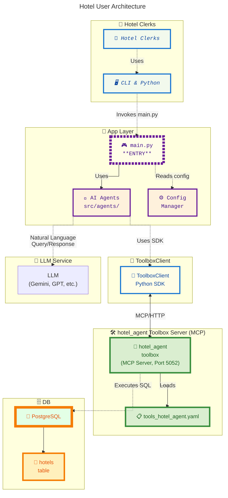

```mermaid
---
title: Hotel User Architecture
config:
  layout: dagre
  flowchart:
    handDrawn: true
    curve: stepBefore
    htmlLabels: false
---
flowchart TD
  subgraph "👥 Hotel Clerks"
    Clerk["🏨 Hotel Clerks"]
    U1["🖥️ CLI & Python"]
  end
  subgraph "🚀 App Layer"
    direction LR
    A1["🎮 main.py<br/>**ENTRY**"]
    A2["🤖 AI Agents<br/>src/agents/"]
    A3["⚙️ Config<br/>Manager"]
  end
  subgraph "🔌 ToolboxClient"
    SDK["🔌 ToolboxClient<br/>Python SDK"]
  end
  subgraph "🤖 LLM Service"
    LLM["LLM<br/>(Gemini, GPT, etc.)"]
  end
  subgraph "🛠️ hotel_agent Toolbox Server (MCP)"
    T2["🔧 hotel_agent<br/>toolbox<br/>(MCP Server, Port 5052)"]
    T2Conf["📋 tools_hotel_agent.yaml"]
  end
  subgraph "🗄️ DB"
    DB["🐘 PostgreSQL"]
    TableHotels["🏨 hotels<br/>table"]
  end
  Clerk -.->|"Uses"| U1
  U1 -.->|"Invokes main.py"| A1
  A1 -->|"Uses"| A2
  A1 -.->|"Reads config"| A3
  A2 -.->|"Uses SDK"| SDK
  SDK <--> |"MCP/HTTP"| T2
  T2 -->|"Loads"| T2Conf
  T2 -.->|"Executes SQL"| DB
  DB --> TableHotels
  A2 -.->|"Natural Language Query/Response"| LLM
  classDef userStyle fill:#e3f2fd77,stroke:#1976d2,stroke-width:3px,color:#0d47a1,font-size:15px,font-family:Courier New, font-style:italic
  classDef appStyle fill:#f8bbd033,stroke:#6a1b9a,stroke-width:3px,color:#4a148c,font-size:15px,font-family:Courier New
  classDef sdkStyle fill:#fffde7,stroke:#1976d2,stroke-width:3px,color:#0d47a1,font-size:15px
  classDef serverStyle fill:#c8e6c9aa,stroke:#388e3c,stroke-width:4px,color:#1b5e20,font-size:15px
  classDef dbStyle fill:#ffecb3c4,stroke:#f57c00,stroke-width:4px,color:#e65100,font-size:15px
  class Clerk,U1 userStyle
  class A1,A2,A3 appStyle
  class SDK sdkStyle
  class T2,T2Conf serverStyle
  class DB,TableHotels dbStyle
  style A1 stroke-width:7px,stroke-dasharray:6 3,fill:#fffde7
  style DB stroke-width:7px,fill:#e3ffe6
```